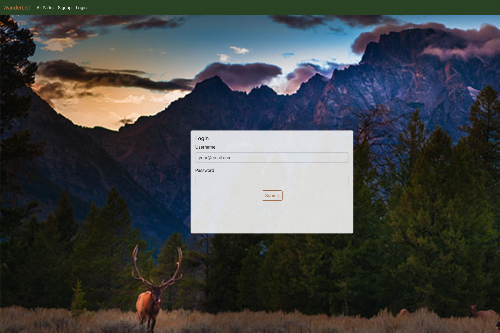

## WanderList

- Brady Kautsch
- Dasia Razo
- Drake Phamanivong
- Sam Major
- Yin-Tung Chen

Escape the busy and chaotic city life and immerse yourself in the splendor of the natural world. WanderList assists users in arranging and managing their trips to national parks. Users can conveniently access park descriptions, activities, and alerts to select their preferred travel destinations.

## Design

- [API design](docs/RestfulAPIs.MD)
- Wireframe disgrams

## Technologies Used

- PostgreSQL
- FastAPI
- JavaScript
- Python
- React
- Redux
- Bootstrap
- CSS

## Intended market

Our travel website is designed to attract both adventurous individuals and families who share a passion for exploring new destinations and immersing themselves in the beauty of natural environments.

## Functionality

- While exploring the homepage, users are greeted with a captivating backdrop showcasing dynamic scenes from nature. This visual feature instantly immerses users in the ambiance of natural surroundings. By clicking "Get Started," users will be redirected to the page displaying a list of parks.
- On the top navigation bar of the park list page, users have the option to either create a WanderList account or log in to their existing account using the designated buttons.
- The Park listed page is open for all the user to view the national parks image, name, location and the park description.
- In park detail page, users will see the park's location, description, activities, park alert.
  - If the user is logged in, the create trip button will display.
- Logged in users will see "My Upcoming Trips", "My Trip History", "Create Trip", "Create Trip Note", and "Logout" link in the navigation bar.
- "Create Trip" will open a form that the user can fill in and submit to create their trip to a national park, then redirect users to the "My Upcoming Trips"
- "My Upcoming trips" will list all of the trips that user has been created.
  - By clicking "Details" it will redirect the user to the trip detail page
- Logged in user can create trip notes linked to their trips
- On the trip detail page, users can view the notes they created and trip status change button once their trip is completed or cancelled.
- "My Trip History" will lists the trips that user has been completed or cancelled.

### Project images

### Unit Test

- Brady Kautsch: get_all_trips
- Dasia Razo: get_all_parks
- Drake Phamanivong: create_trip
- Sam Major: get_one_note
- Yin-Tung Chen: get_one_trip

## Project Initialization

To view this application on your local machine, please follow these steps:

1. Clone this repository to your local machine
2. CD into the new project directory
3. Obtain a NPS Api key (https://www.nps.gov/subjects/developer/get-started.htm)
4. Make Signing Key
   - Install openssl
   - run openssl rand -hex 32
5. Make a .env file with the following variables:

   - REACT_APP_SIGNING_KEY = "the signing key you created"
   - REACT_APP_NPS_KEY = "the NPS Api key"
   - REACT_APP_API_HOST = "http://localhost:8000/"
   - REACT_APP_ALERT_HOST = "https://developer.nps.gov/api/v1"

6. On the terminal (in the project directory), run docker volume create wander-list-data
7. Run "docker compose build" command
8. Run "docker compose up" command
9. In terminal of "module3-project-gamma-api-1", run "python park.py" command, this will load our park list data
10. Enjoy the full version of WanderList!
